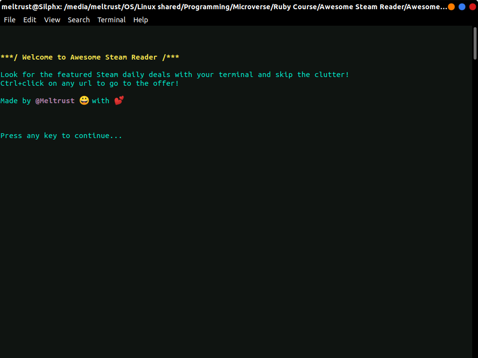

# Awesome Steam Reader

> An awesome Steam store scrapper.



Awesome Steam Reader is a Steam store scrapping tool. It scrapes data from the main Steam store page and the initial focus is to get information of the main featured deals for the day using your terminal in full color.

## Built With

- Ruby language!
- HTTparty gem
- Nokogiri gem

## Future Additions

- Tables.
- Pagination.
- Read and present other info, like best-sellers and trending games.

## Getting Started

To get a local copy up and running follow these simple example steps.

### Prerequisites

- Ruby must be installed in your machine.

### Setup

- Clone this repository into your local machine.
- Run this command to get the dependencies.

```bash
  $ bundle install
```

- Run the main file by typing this in your command line:

```bash
  $ cd Awesome-Steam-Reader
  $ cd bin
  $ ruby asr
```

### Usage

Just follow the on screen instructions.

## Authors

👤 **Miguel Tapia Escalera**

- Github: [@Meltrust](https://github.com/Meltrust)
- Linkedin: [meltrust](https://www.linkedin.com/in/meltrust/)

## 🤝 Contributing

Contributions, issues and feature requests are welcome!

Feel free to check the [issues page](issues/).

## Show your support

Give a ⭐️ if you like this project!

## Acknowledgments

- Hat tip to anyone whose code was used
- Inspiration
- etc

## 📝 License

This project is [MIT](lic.url) licensed.
